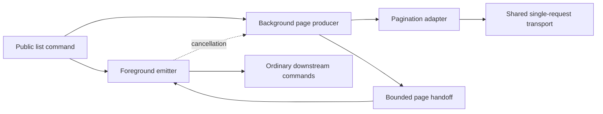

# Pipeline prefetch - Design

A module-private coordinator runs page retrieval in an in-process background runspace and emits results on the foreground pipeline thread. Service adapters interpret pagination; the module's shared transport retains ownership of request policy.

## Specification

[Pipeline prefetch specification](spec.md) defines the required behavior. The [GitHub implementation profile](implementation.md) supplies concrete settings and integration points.

## Approach

The synchronous path and the prefetched path use the same single-page transport and pagination adapter. Disabling prefetch changes scheduling, not request interpretation or output conversion.

One producer follows continuation tokens sequentially. Its work overlaps downstream processing, not other requests in the same continuation chain. This avoids trying to request a cursor that is not yet known.

The reusable unit is the coordinator and its adapter contract. It contains no service names, endpoint rules, or resource-specific output types. Implementations can remain module-private or use an existing owned library without imposing a new public runtime dependency.

## Alternatives considered

| Option | Trade-off | Role |
| --- | --- | --- |
| Ordinary synchronous pagination | Simple and preserves non-prefetched timing; cannot overlap retrieval with downstream work | Opt-out path |
| Collect every result before emitting | Delays first output and retains the complete collection | Rejected |
| Parallelize downstream commands | Changes consumer behavior and side-effect ordering rather than solving producer scheduling | Outside scope |
| Separate-process background job | Adds serialization and authentication/bootstrap costs; can change object types | Not the baseline |
| In-process producer with bounded handoff | Overlaps retrieval while retaining foreground pipeline behavior | Baseline |

## Architecture

| Component | Responsibility |
| --- | --- |
| Public command | Resolve caller settings and select the eligible operation; preserve the opt-out |
| Coordinator | Own background lifetime, page capacity, completion, and cancellation |
| Pagination adapter | Decode one response, classify it, and determine the next continuation |
| Shared transport | Authenticate, refresh, throttle, retry, time out, and perform one logical page request |
| Foreground emitter | Apply stream preferences and convert accepted items to the established public output |

Only one layer owns pagination for a logical enumeration. Nested helpers use the same owner or call the single-request primitive; they do not create additional default-on producers.

### Capacity accounting

The handoff contains complete page envelopes rather than individual resource nodes. This works for both item-returning commands and low-level commands that return one response envelope per page.

The producer reserves a future-page slot before starting a request. That slot remains occupied while the request is in flight and while its page waits for the emitter. The emitter releases it when it takes ownership of the page.

Consequently, C slots cover queued, producer-held, and in-flight pages together, plus one foreground page. A bounded queue alone is insufficient: fetching before waiting for queue capacity would retain an extra response beyond that contract.

`BlockingCollection<T>` can provide the bounded handoff, with a cancellation-aware capacity reservation such as `SemaphoreSlim`. Completion and failure have a separate control path so they cannot be trapped behind a full data queue.

## Data and contracts

### Adapter boundary

These are logical contracts, not required public function names.

| Contract | Input | Output and ownership |
| --- | --- | --- |
| Initialize | Explicit operation and context selection | Worker-owned request state and read-only eligibility |
| Request one page | Request state, continuation, cancellation | One response through the shared transport; retries stay inside that transport |
| Decode page | Response and operation-specific selectors | One validated page envelope |
| Convert item | Accepted raw item | Established public output object, created in the foreground |

A page envelope contains:

| Field | Meaning |
| --- | --- |
| Items | Materialized results from this page only, with declared item-enumeration semantics |
| HasMore | Whether another page exists |
| Continuation | Opaque next-page state interpreted only by the adapter |
| Diagnostics | Ordered, classified stream records associated with this response |
| Metadata | Non-secret response context required for the public contract or diagnostics |

A page-returning API puts its existing response envelope in `Items` as one output item. An object-returning API puts the page's resource records in `Items`. The coordinator does not flatten arbitrary nested collections or reinterpret provider response shapes.

Page data is immutable after publication. Request filters and variables are invocation-owned copies; shallow copying a table is insufficient when it contains mutable nested values.

### Completion and failure

Completion is separate from "no page is available right now." Terminal state records success, cancellation, or failure independently of the data queue.

A permanent request or decoding error closes publication and records the failure. The foreground drains accepted pages and then reports that error at the failed-page boundary. It does not retry the whole enumeration or replay emitted pages.

Warnings and partial-result diagnostics are delivered through the foreground command runtime before the associated page's items. Caller preferences apply there. A warning promoted to an error cancels production rather than continuing to emit that page.

Worker startup errors, script parse failures, and invocation failures are observed through the actual PowerShell invocation state and error streams, not only through a queue populated by the worker script. Otherwise, failure before the worker's own error handling starts could leave the consumer waiting forever.

### Lifecycle

1. Validate eligibility, settings, and output policy before side effects. Establish the cleanup scope before allocating worker resources.
2. Initialize a worker using an explicit module path/version and explicit invocation state. Load the adapter in that worker's module scope.
3. Reserve capacity, request and classify a page, publish it, and advance continuation. All capacity and retry waits accept cancellation.
4. Read pages while also observing cancellation and terminal worker state. Emit items immediately; retain neither completed pages nor a second result list.
5. On normal completion, observe invocation completion exactly once and dispose owned resources.
6. On early stop or failure, signal cancellation first, request background stop, observe completion within the declared bound, and dispose after the producer stops.

Cleanup is idempotent and covers normal completion, partial initialization, worker failure, and downstream early termination. PowerShell `try`/`finally` and, where supported and needed, the advanced function's `clean` block cover the entire lifetime.

The foreground does not block forever on queue enumeration or a synchronous stop call. Stop and completion waits are bounded. Only the producer completes the data queue during normal operation; a competing foreground completion must not race with publication.

An intentional downstream stop discards unconsumed speculative results and their pending speculative failures. A downstream error remains primary if cleanup also encounters a failure; cleanup details are retained as secondary diagnostics rather than silently swallowed or substituted.

### Runspace and stream boundaries

Worker code executes in the worker's session state. An arbitrary caller-captured scriptblock is not treated as an isolated adapter merely because it is passed to another runspace.

The worker imports the same module build and dependencies explicitly. Its adapter is resolved inside that module's scope so private helpers remain available. Mutable global caches and static state are not assumed to become isolated through runspace creation.

The worker emits no data through the background invocation's ordinary success collection. Classified diagnostics travel through the bounded page path; terminal faults use the control path. PowerShell stream collections are observed and drained so they do not become an unbounded secondary log.

## Security

Authentication and refresh stay in the shared request policy, with worker-owned context and synchronization for any shared credential store. Initialization resolves interactive authentication before background retrieval. A background request never opens an unexpected login prompt; inability to refresh noninteractively is an explicit authentication failure.

Credentials and sensitive request bodies are excluded from coordination diagnostics. Plaintext credential lifetime is limited to transport use, without claiming that managed memory can be reliably zeroed.

Read-only eligibility is declared by a trusted adapter, not inferred from a command name or HTTP method alone. A GraphQL read may use POST; a generic GraphQL request may instead contain a mutation. Arbitrary caller-provided mutations are never repeated speculatively.

Continuation URLs are validated under the same endpoint and credential-forwarding policy as ordinary requests. Prefetch does not create a second, more permissive HTTP client path.

## Testing strategy

The adopting module implements the specification scenarios in its existing runner. A controlled page source provides release gates, request counters, fixture responses, cancellation observation, and injected faults.

Overlap is demonstrated by holding downstream processing and observing a later request before releasing it. Bounds are demonstrated by withholding capacity and observing that no additional request starts. These checks use synchronization rather than timing-sensitive sleeps.

Transport seams execute inside the actual worker. A mock installed only in the caller's runspace is not assumed to intercept worker requests. Bootstrap, module import, and class conversion also run through the built module.

Coverage includes empty/single/multiple results, empty intermediate pages, invalid continuation, partial responses, exhausted retries, token refresh, worker bootstrap failure, cancellation while waiting on either side, and immediate downstream termination. Adapter fixtures exercise both page-returning and item-returning contracts.

Non-destructive integration coverage uses stable read-only resources. Mutation-sensitive pagination is simulated with fixtures; repository deletion is not required to prove concurrency.

Benchmarks record time to first item, total enumeration time, requests issued, peak retained pages, and shutdown latency for both scheduling modes. They distinguish potential overlap from a guaranteed speedup.

## Rollout and operability

Every eligible paginated result producer routes through the shared coordinator and propagates the opt-out. An adapter becomes eligible only when it meets the same contract in both modes; unsupported cases are explicitly documented rather than silently falling back after a worker failure.

Activation covers all eligible call paths, including private helpers behind public wrappers. A prototype covering one endpoint is not treated as module-wide adoption.

Diagnostics distinguish consumer backpressure, source wait, transport backoff, completion, and cancellation. They remain on their intended PowerShell streams and never contaminate object output.

The capacity setting's unit is always stated. A setting formerly measured in nodes cannot silently become a page-count setting. The explicit opt-out provides a predictable escape hatch without changing result shape.
